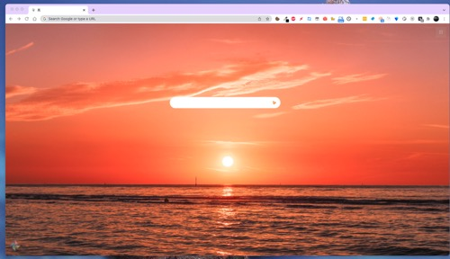

## 岚

一款极简的 chrome 浏览器扩展，为喜欢极简风和壁纸的用户提供美好的浏览器标签页体验！

## 截图

## 功能说明

- 超高清壁纸，左下角风车点击随机切换
- 左上角时间显示
- 上下左右可选的书签快速入口，默认可以固定书签到主页面，初始化时需要点击右上角 📌 图标唤起书签搜索功能，然后可以固定书签，书签图标可以右键更新或从页面移除
- 右上角菜单
  - 必应本周壁纸
  - 壁纸下载
  - 番茄钟 - 小憩几分钟
  - 设置
    - 图标大小
    - 画质设置（高画质对网速和网络有要求，图片数据在国外服务器）
    - 左上角时间显示
    - 番茄钟时间
    - 搜索框标签页打开方式
    - 联系方式

> 中间的搜索框支持必应、谷歌、YouTube、知乎和 github 搜索引擎

切换方法：

- youtube: y + space
- zhihu: z + space
- google: gg + space
- bing: b + space
- github: gh + space

## 安装方法

### 商店安装

地址是：https://chrome.google.com/webstore/detail/%E5%B2%9A/pgbomeeopmblmenapfgbhjobohpnegil

传送门:[岚](https://chrome.google.com/webstore/detail/%E5%B2%9A/pgbomeeopmblmenapfgbhjobohpnegil)

### 本地安装

#### chrome 浏览器

- 在 release 下载压缩包，解压后放在自己常用的软件安装路径下
- 打开浏览器扩展设置
  - 打开开发者模式
  - 加载已解压文件
  - 选择解压的目录并确定

#### edge 浏览器

类似 chrome 浏览器的本地安装方法，如果有所疑问可以搜索必应，亦或给我发邮件联系我。
